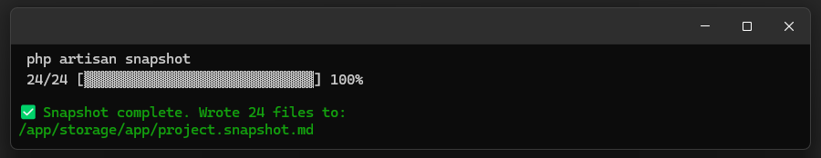
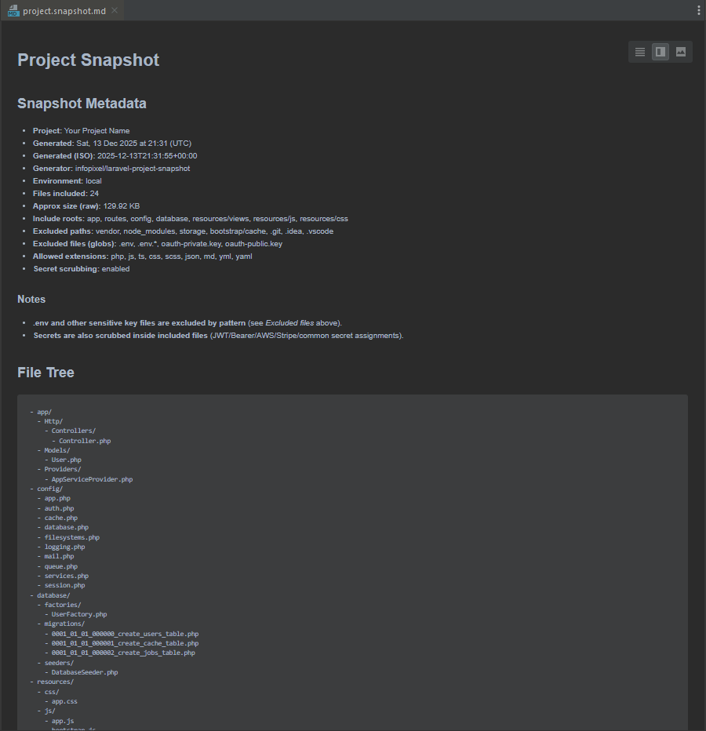
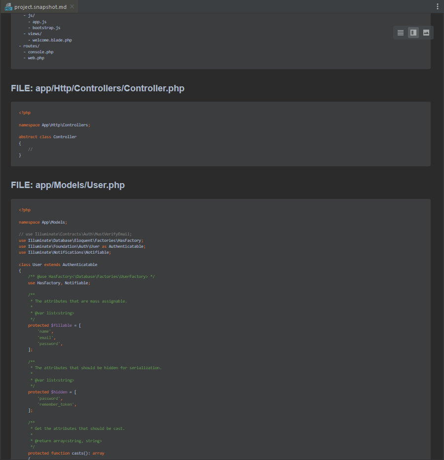
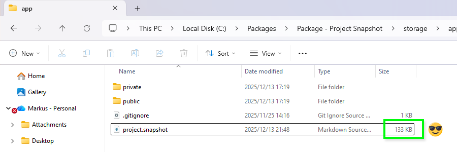

# Laravel Project Snapshot

📸 **A workaround for full project .zip file upload limitations by AI-powered language models (LLM).**

It generates a single, lightweight snapshot of your project — a fraction of the size of the full codebase, that can be uploaded to your LLM of choice, allowing the AI to understand your architecture and code and collaborate with you effectively.

Export a Laravel project snapshot (file tree + source code) into a single Markdown file**, designed specifically for AI analysis, code review, auditing, and architecture discussions.
It was specifically designed to solve the common problem of uploading large full-project `.zip` files directly into AI-powered language models.
Instead of uploading entire projects, this tool produces a **single, structured Markdown file that preserves project context, hierarchy, and source code, making it ideal for ChatGPT, LLMs, and automated review pipelines.

This package generates a safe, readable, deterministic snapshot of your project without binaries, without vendor noise, and with automatic secret redaction.

---

## 📦 Installation (dev only)

```bash
composer require --dev infopixel/laravel-project-snapshot
```

## ▶️ Command line 

```bash
php artisan snapshot
```

## ✨ Features

- 🧠 Optimised for **ChatGPT / LLM ingestion**
- ✅ Single-file snapshot (`project.snapshot.md`)
- 🌳 Clean, readable **file tree with depth**
- 🔒 **Secret scrubbing** (JWTs, API keys, Bearer tokens, private keys)
- 🚫 Will not upload files containing sensitive data like `.sqlite`,`.sql`,`.db`, etc. (unless explicitly permitted via yourself in the configuration)
- 🚫 Automatically excludes sensitive files (`.env`,`.`, OAuth keys, etc.)
- 📦 Whitelist-based file inclusion (no binaries)
- 🧪 **Dev-only safe** (won’t run in production)
- ⏳ Console **progress bar**
- 🧾 Rich **snapshot metadata block**
- ⚙️ Fully configurable

---

## 📦 Screenshots

**Command line**


**project.snapshot.md (Metadata)**


**project.snapshot.md (File Display)**


**File Size (project.snapshot.md)**


## 🚨 Important Safety Notice

This package is intended for **development environments only**.

- Installed via `require-dev`
- Refuses to run in `production`
- Explicitly excludes sensitive files
- Redacts secrets even if accidentally committed

---


